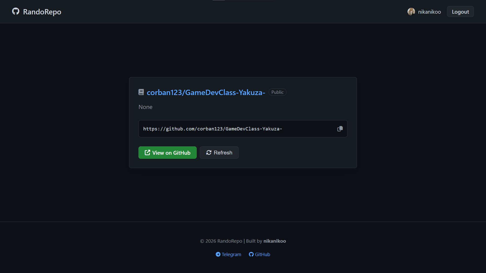

# RandoRepo

<p align="center">
  
</p>

<p align="center">
  
  
  
  
</p>

---

**RandoRepo** is a stylish, modern web app that helps you discover interesting and unexpected projects on GitHub. Find inspiration, try a new tool, or explore the vast world of open source code.

## 🛠 Installation

Getting RandoRepo up and running is easy:

1. **Clone the repository:**
   ```bash
   git clone https://github.com/nikanikoo/randorepo.git
   cd randorepo
   ```

2. **Install dependencies:**
   ```bash
   pip install Flask requests python-dotenv
   ```

3. **Configure environment variables:**
   Copy the example env file and add your GitHub OAuth credentials:
   ```bash
   cp .env.example .env
   ```

4. **Run the application:**
   ```bash
   python app.py
   ```

## ⚙️ Configuration

To use the full potential of RandoRepo (OAuth login), set up these variables in your `.env`:

| Variable | Description |
|----------|-------------|
| `GITHUB_CLIENT_ID` | Your GitHub OAuth App Client ID |
| `GITHUB_CLIENT_SECRET` | Your GitHub OAuth App Client Secret |
| `FLASK_SECRET_KEY` | A secret key for session management |
| `GITHUB_TOKEN` | (Optional) A personal access token for higher global limits |